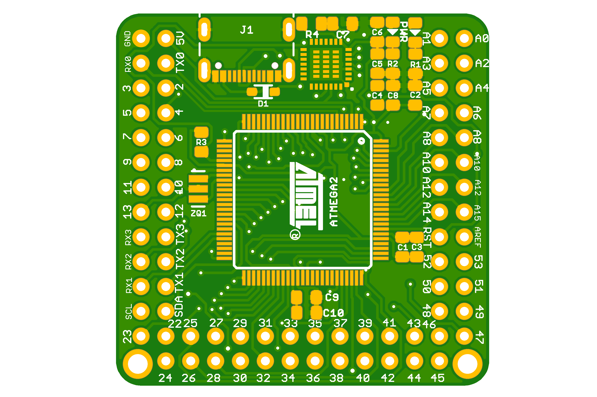
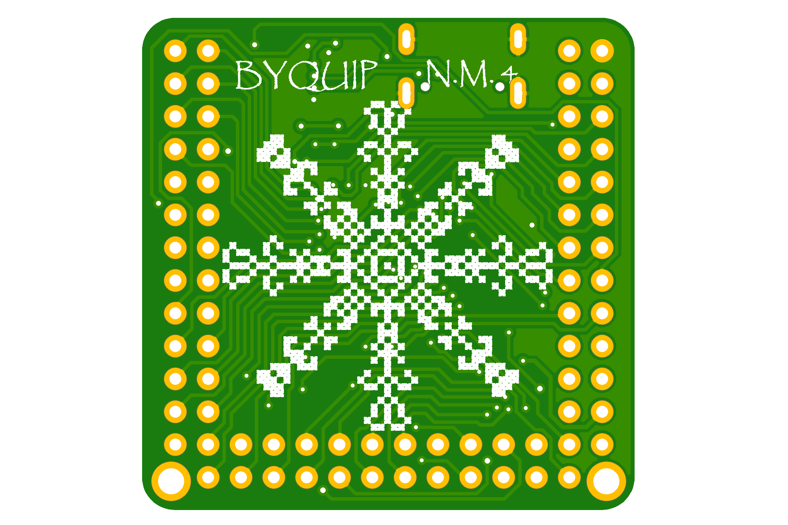

# Naked Mega 4
This is hardware design of Arduino Mega 2560 core. \
This design is based on Naked Mega \
designed by [Fuzzy Studio](https://github.com/FuzzyNoodle/Fuzzy-Naked-Mega) and [geraicerdas](https://github.com/geraicerdas/Cerdas-F2).

Tutorial [here](https://www.hackster.io/news/a-bare-naked-arduino-mega-2314647cf772)

This repo is an update of `geraicerdas` design to be more like Naked Mega 4.0 \
Instead of "Batik" design in the bottom Silkscreen as an Indonesian culture from `geraicerdas`. \
I added some vyshyvanka pattern as Ukrainian culture in the bottom Silkscreen which represent my hometown name Rubizhne in "Brodivsk" writing alphabet.

